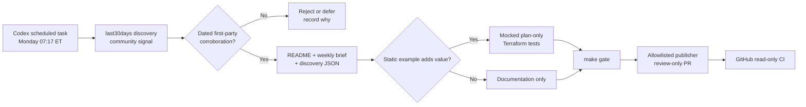

# Infrastructure Curiosity

[](https://github.com/cekapitan/infrastructure_curiosity/actions/workflows/ci.yml)
[](https://github.com/cekapitan/infrastructure_curiosity/actions/workflows/freshness.yml)

An evidence-backed, test-only radar for AWS capabilities and infrastructure tooling worth bringing to a platform team.

Every week, a local Codex scheduled task uses the installed `last30days` skill to discover practitioner discussion, then checks promising items against dated first-party documentation. Accepted items become a review-only pull request with a short team brief, a structured evidence record, and - only when useful - a mocked infrastructure example. Nothing in this repository provisions infrastructure.

> [!IMPORTANT]
> This is a learning and evaluation repository. It has no Terraform backend, cloud credentials, deployment workflow, `apply`, or auto-merge path.

## Current radar

| Status | Item | Why it belongs here | Evidence | Test-only example |
|---|---|---|---|---|
| New in the current window | S3 same-day transition to Standard-IA and One Zone-IA | Backups, logs, and compliance objects that become cold immediately no longer need 30 days in S3 Standard before an IA transition. The IA classes still have minimum-storage-duration charges, so access patterns and object sizes matter. | [2026-07-16 discovery](discoveries/aws-s3-same-day-ia.json) | [Terraform](examples/aws/s3-same-day-ia/) |
| New operational lesson | Cost controls must tolerate bad provider estimates | AWS acknowledged that inaccurate Cost Explorer estimates triggered erroneous budget and anomaly alerts. Treat billing telemetry as fallible: layer alerts, service quotas, architectural caps, and independent usage signals. | [2026-07-20 discovery](discoveries/aws-cost-estimate-incident.json) | Documentation only |
| Established capability, newly cataloged | AWS KMS multi-Region keys | One logical key identity and shared key material across Regions can simplify client-side encryption, active-active signing, and disaster recovery. Policies, grants, aliases, tags, and enabled state remain regional. | [2021 capability review](discoveries/aws-kms-multi-region.json) | [Terraform](examples/aws/kms-multi-region/) |
| Tool watch | Cloud workspaces for coding-agent teams | Conductor Cloud shows the infrastructure-tool direction: persistent isolated microVM workspaces, collaboration, and an API. The adoption question is whether isolation, least privilege, auditability, and cost controls meet team requirements. | [2026-07-30 discovery](discoveries/conductor-cloud-workspaces.json) | Documentation only |

The full dated brief is [docs/weekly/2026-08-10.md](docs/weekly/2026-08-10.md). Rejected or deferred candidates stay in that brief so the next run does not mistake buzz for a practice.

## How the loop works



The controls are intentional:

- The local task uses the installed skill and its configured public research sources; GitHub Actions does not receive those credentials.
- First-party AWS and tool documentation decides whether a community lead is accepted.
- IaC tests use mocked providers and Terraform's `command = plan`; no AWS credentials or APIs are used.
- The scheduled agent may edit only the research catalog, weekly notes, examples, and their colocated Terraform tests. Fixed repository contract tests require a human-authored change.
- A protected publisher verifies the exact diff and opens an automation branch PR. It cannot push to `main` or merge.
- CI has `contents: read` only and runs no cloud authentication.

See [docs/automation.md](docs/automation.md) for installation and security boundaries.

## Repository layout

```text
.
├── discoveries/          Structured, deduplicated evidence records
├── docs/weekly/          Dated team-ready briefs
├── examples/aws/         Static Terraform examples with mocked tests
├── tests/                Repository and no-provision contracts
├── automation/           Local weekly runner and launchd template
├── .codex/               Trusted publisher and narrow execution rule
└── .github/workflows/    Read-only CI and freshness monitoring
```

## Validate locally

Prerequisites: Terraform 1.7+, Python 3.11+, TFLint, ShellCheck, and Gitleaks.

```bash
make gate
```

The gate runs repository contract tests, Terraform formatting/validation/mocked tests, TFLint, ShellCheck, and secret scanning. It does not run `terraform plan` outside mocked `.tftest.hcl` files and never runs `apply`.

## Weekly operating model

The preferred scheduler is a local Codex scheduled task because it can invoke the installed `last30days` skill. A portable launchd runner is also included for users who want an OS-level schedule. Both consume the same versioned prompt in [automation/WEEKLY_PROMPT.md](automation/WEEKLY_PROMPT.md).

A successful research run opens a review-only PR with a dated brief, even when the honest result is **no radar additions**. In that case the brief records what was checked and why candidates were rejected or deferred, while the README only advances its latest-brief link. Novelty alone is not sufficient; relevance, first-party verification, an adoption question, and a safe demonstration path matter more.

## Contributing

Read [CONTRIBUTING.md](CONTRIBUTING.md) before adding a practice. All additions need a dated primary source and must pass the no-provision contract. Report automation vulnerabilities through the process in [SECURITY.md](SECURITY.md). This project is licensed under the [MIT License](LICENSE).
